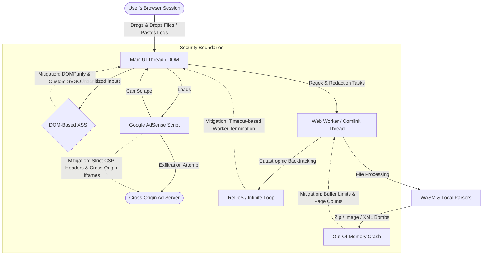
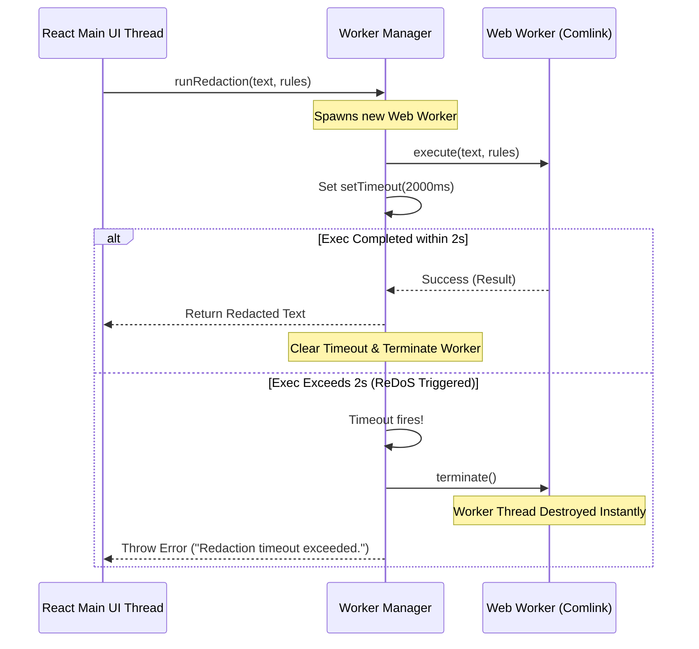
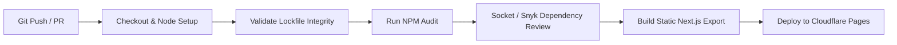

# ZeroNode Master Security Review & Threat Model

**Author:** Elite Application Security Engineer & DevSecOps Architect
**Project:** ZeroNode (100% Client-Side Serverless Developer Utility Platform)
**Target Environment:** Cloudflare Pages (Edge CDN)
**Classification:** Proprietary / Security Review

---

## Executive Summary
ZeroNode is built on a "zero-upload, zero-compute" architecture where user data stays strictly in local memory (RAM) and processes within the browser's sandbox. While this design completely eliminates server-side vulnerabilities (such as SQL Injection, SSRF, and RCE), it shifts the security perimeter entirely to the client side. 

This document provides a comprehensive Threat Model and Security Architecture Review for ZeroNode. It identifies critical client-side attack surfaces and outlines developer guidelines, configurations, and code blocks to secure the platform.



---

## 1. DOM-Based XSS & Input Sanitization

### Risk Analysis
ZeroNode includes tools that handle rich content conversion, rendering, or compilation. Each presents a unique DOM-based Cross-Site Scripting (XSS) attack vector:
*   **Markdown-to-HTML**: The marked parser compiles user-provided Markdown strings directly into HTML. If the generated HTML is injected into the DOM, any embedded scripts (e.g., `<script>`, `<iframe src="javascript:...">`, or inline event handlers like ``) will execute in the context of the user's session.
*   **SVG-to-JSX**: SVG is an XML-based language. It supports embedding scripts and styles. When SVG input is compiled into JSX code, a naive string replacer will output a React element that, when rendered or previewed, can execute malicious scripts (e.g., via `<svg onload="alert(1)">`).
*   **Data Converter (XML/JSON)**: Transforming XML payloads into JSON structures can result in the execution of scripts if the values are later rendered in a visual table, diff view, or text field without proper encoding.

| Threat ID | Threat Description | Vulnerable Component | Severity |
| :--- | :--- | :--- | :--- |
| **TN-XSS-01** | User parses malicious Markdown containing nested XSS payloads, executing script in parent origin. | Markdown-to-HTML (`DataConverterClient.tsx`) | **High** |
| **TN-XSS-02** | SVG compiler outputs JSX carrying interactive JavaScript handlers, triggering execution during preview. | SVG-to-JSX (`DevToolkitClient.tsx`) | **High** |
| **TN-XSS-03** | Malicious XML attributes parsed and loaded into HTML Table View trigger execution on cell render. | Data Converter (`DataConverterClient.tsx`) | **Medium** |

### Implementation Guidelines
1.  **Strict DOMPurify Integration**: Never use `dangerouslySetInnerHTML` without purifying the HTML markup beforehand.
2.  **Explicit DOMPurify Configuration**: Customize DOMPurify to allow CSS styling while stripping all scripting elements, forms, action attributes, and `javascript:` URIs.
3.  **Sanitized SVG Compiler**: Before converting SVGs to JSX, parse them with a local browser-native `DOMParser` and clean the nodes of scripting elements.

#### React Sanitization Component
The following React component wraps rendering using `dompurify` to enforce local XSS mitigation:

```tsx
import React, { useMemo } from 'react';
import DOMPurify from 'dompurify';

interface SafeHtmlProps {
  htmlContent: string;
  className?: string;
}

export const SafeHtmlRenderer: React.FC<SafeHtmlProps> = ({ htmlContent, className }) => {
  const cleanHtml = useMemo(() => {
    // Configure DOMPurify for strict rendering
    return DOMPurify.sanitize(htmlContent, {
      ALLOWED_TAGS: [
        'p', 'br', 'strong', 'em', 'h1', 'h2', 'h3', 'h4', 'h5', 'h6', 
        'ul', 'ol', 'li', 'code', 'pre', 'span', 'blockquote', 'table', 
        'thead', 'tbody', 'tr', 'th', 'td', 'a', 'mark', 'div', 'svg', 'path'
      ],
      ALLOWED_ATTR: ['href', 'title', 'class', 'className', 'target', 'rel', 'viewBox', 'd', 'fill', 'stroke'],
      ALLOW_UNKNOWN_PROTOCOLS: false,
      SAFE_FOR_TEMPLATES: true,
      // Strip javascript:, data:, and vbscript: URI schemes
      ALLOWED_URI_REGEXP: /^(?:(?:https?|mailto|ftp):|[^a-z]|[a-z+.-]+(?:[^a-z+.-:]|$))/i
    });
  }, [htmlContent]);

  return (
    <div 
      className={className} 
      dangerouslySetInnerHTML={{ __html: cleanHtml }} 
    />
  );
};
```

---

## 2. ReDoS (Regular Expression Denial of Service) & Worker Exhaustion

### Risk Analysis
The **Text Redactor** and **Regex Tester** tools allow users to supply arbitrary regular expressions or paste massive log files.
*   **Catastrophic Backtracking**: Standard V8 Regex engine (used in Chrome, Edge, Node.js) uses a backtracking NFA algorithm. Patterns containing nested quantifiers with overlapping classes (such as `(a+)+$`, `([a-zA-Z]+)*$`, or `(\d+)*$`) execute in exponential $O(2^n)$ time when matched against nearly matching inputs (e.g., `aaaaaaaaaaaaaaaaaaaaaaaaab`).
*   **UI Thread Freezing**: Since JS is single-threaded, running a backtracking regex on the main thread will lock up the event loop. The UI freezes, interaction ceases, and the browser tab eventually crashes.

| Threat ID | Threat Description | Vulnerable Component | Severity |
| :--- | :--- | :--- | :--- |
| **TN-RE-01** | User enters catastrophic regex that matches logs with long repeating suffixes, freezing browser tab. | Text Redactor (`TextRedactorClient.tsx`) | **High** |
| **TN-RE-02** | Custom regex patterns entered in the rules manager crash the browser via infinite backtracking loop. | Custom Rule Parser | **High** |

### Web Worker Termination Architecture
To safeguard the user interface, all regex executions must be delegated to background Web Workers. Because a worker thread trapped in a CPU-bound infinite backtracking loop cannot receive new postMessage events, we **cannot clean-up the loop gracefully via messages**. 

The main UI thread must control the worker's lifetime via a wrapper that enforces a hard timeout limit and calls `.terminate()` when exceeded.



#### Worker Implementation File: `public/workers/redact.worker.js`
```javascript
// Local worker script for regex execution
self.onmessage = function (e) {
  const { input, options, customRules } = e.data;
  let result = input;
  let matchCount = 0;

  const maskValue = (val, label) => `[REDACTED_${label.toUpperCase()}]`;

  const applyRedaction = (regex, label) => {
    const matches = result.match(regex);
    if (matches) {
      matchCount += matches.length;
      result = result.replace(regex, (match) => maskValue(match, label));
    }
  };

  try {
    if (options.emails) applyRedaction(/[a-zA-Z0-9._%+-]+@[a-zA-Z0-9.-]+\.[a-zA-Z]{2,}/g, 'EMAIL');
    if (options.creditCards) applyRedaction(/\b(?:\d[ -]*?){13,16}\b/g, 'CC');
    if (options.ips) {
      applyRedaction(/\b(?:\d{1,3}\.){3}\d{1,3}\b/g, 'IP');
      applyRedaction(/(?:[a-fA-F0-9]{1,4}:){7}[a-fA-F0-9]{1,4}/g, 'IPV6');
    }
    if (options.phones) applyRedaction(/\b(?:\+?\d{1,3}[-. \s]?)?\(?\d{3}\)?[-. \s]?\d{3}[-. \s]?\d{4}\b/g, 'PHONE');
    if (options.tokens) {
      applyRedaction(/Bearer\s+[A-Za-z0-9\-\._~\+\/]+={0,2}/g, 'TOKEN');
      applyRedaction(/eyJ[A-Za-z0-9\-_]+\.[A-Za-z0-9\-_]+\.[A-Za-z0-9\-_]+/g, 'JWT');
      applyRedaction(/(?<![A-Z0-9])[A-Z0-9]{20}(?![A-Z0-9])/g, 'AWS_KEY');
    }

    // Apply custom user regex rules
    for (const rule of customRules) {
      const regex = rule.isRegex 
        ? new RegExp(rule.pattern, 'g')
        : new RegExp(rule.pattern.replace(/[-\/\\^$*+?.()|[\]{}]/g, '\\$&'), 'g');
      applyRedaction(regex, rule.name);
    }

    self.postMessage({ status: 'success', result, matchCount });
  } catch (err) {
    self.postMessage({ status: 'error', error: err.message });
  }
};
```

#### Worker Manager Hook: `src/hooks/useRedactWorker.ts`
```typescript
import { useState, useCallback } from 'react';

interface RedactOptions {
  emails: boolean;
  creditCards: boolean;
  ips: boolean;
  phones: boolean;
  tokens: boolean;
}

interface CustomRule {
  id: string;
  name: string;
  pattern: string;
  isRegex: boolean;
}

export const useRedactWorker = (timeoutMs = 2000) => {
  const [loading, setLoading] = useState(false);

  const executeRedact = useCallback((
    input: string,
    options: RedactOptions,
    customRules: CustomRule[]
  ): Promise<{ result: string; matchCount: number }> => {
    return new Promise((resolve, reject) => {
      setLoading(true);

      // Instantiating worker
      const worker = new Worker('/workers/redact.worker.js');

      const timer = setTimeout(() => {
        worker.terminate();
        setLoading(false);
        reject(new Error('Process terminated: Execution exceeded safety timeout. (Potential ReDoS pattern detected)'));
      }, timeoutMs);

      worker.onmessage = (e) => {
        clearTimeout(timer);
        worker.terminate();
        setLoading(false);

        if (e.data.status === 'success') {
          resolve({ result: e.data.result, matchCount: e.data.matchCount });
        } else {
          reject(new Error(e.data.error || 'Worker processing failed.'));
        }
      };

      worker.onerror = (err) => {
        clearTimeout(timer);
        worker.terminate();
        setLoading(false);
        reject(err);
      };

      worker.postMessage({ input, options, customRules });
    });
  }, [timeoutMs]);

  return { executeRedact, loading };
};
```

---

## 3. Malicious File Parsing & Client-Side "Bombs"

### Risk Analysis
Processing files entirely inside browser memory exposes the client to parsing exploits and volumetric exhaustion attacks:
*   **XML External Entity (XXE)**: An XML file containing external entity declarations can attempt to make the browser parser resolve URIs. While standard browser-based `xml-js` or simple object mapping libraries do not parse external resources automatically, default browser DOMParser configurations can still execute script triggers if schema configurations are malicious.
*   **Decompression (Zip) Bombs**: In the Batch Processor, a user can upload a small zip archive (e.g., a few KB) containing highly compressed identical bytes that expand to gigabytes (e.g., a zip bomb). Extracting this in RAM using standard `JSZip` will consume browser allocations, trigger an Out-of-Memory (OOM) error, and crash the thread.
*   **Image / PDF Pixel Bombs**: Loading compressed images with extreme dimension headers (e.g., $50,000 \times 50,000$ pixels) but small file sizes will decompress into massive arrays (e.g., $10$ GB raw buffer) once loaded into an HTML5 Canvas or `pdf-lib` stream, immediately crashing the tab.

| Threat ID | Threat Description | Vulnerable Component | Severity |
| :--- | :--- | :--- | :--- |
| **TN-BM-01** | Zip bomb exhausts client system RAM during extraction, causing browser freeze or OS lockup. | Batch Processor (`jszip` extraction) | **High** |
| **TN-BM-02** | XXE payload in XML data converter triggers parsing loop or local data exposure error. | XML Parser (`xml-js`) | **Low** |
| **TN-BM-03** | Image/PDF bomb loads massive pixel grid, crashing device graphics processor. | Image Converter / PDF Editor | **Medium** |

### Boundaries & Safeguards
1.  **Strict File Ingestion Filters**: Validate file sizes and types before letting the Javascript engine load the stream.
2.  **Zip Extraction Size Limits**: Before extracting zip entries, iterate through metadata and check the *uncompressed* size of each file. If the total uncompressed size exceeds 250MB, or the compression ratio exceeds $100:1$, abort extraction.
3.  **PDF/Image Resolution Limits**: Read image headers directly to verify dimensions before instantiating HTML5 canvas allocations.

#### Zip Bomb Safeguard Implementation
```typescript
import JSZip from 'jszip';

const MAX_UNCOMPRESSED_SIZE_MB = 250;
const MAX_COMPRESSION_RATIO = 100; // 100:1 ratio limit
const MAX_ZIP_FILES_COUNT = 1000;

export async function safeUnzip(zipBlob: Blob): Promise<JSZip> {
  const zip = new JSZip();
  const loadedZip = await zip.loadAsync(zipBlob);
  
  let totalUncompressedSize = 0;
  let fileCount = 0;

  // Read metadata headers without unpacking bytes
  for (const [, file] of Object.entries(loadedZip.files)) {
    if (file.dir) continue;
    
    fileCount++;
    if (fileCount > MAX_ZIP_FILES_COUNT) {
      throw new Error(`Invalid Zip structure: File count exceeds threshold (${MAX_ZIP_FILES_COUNT}).`);
    }

    const compressedSize = (file as any)._data.compressedSize || 0;
    const uncompressedSize = (file as any)._data.uncompressedSize || 0;
    
    totalUncompressedSize += uncompressedSize;

    // Check compression ratio
    if (compressedSize > 0) {
      const ratio = uncompressedSize / compressedSize;
      if (ratio > MAX_COMPRESSION_RATIO) {
        throw new Error(`Extraction aborted: Zip Bomb detected! File '${file.name}' compression ratio (${ratio.toFixed(1)}:1) exceeds limits.`);
      }
    }

    if (totalUncompressedSize > MAX_UNCOMPRESSED_SIZE_MB * 1024 * 1024) {
      throw new Error(`Extraction aborted: Cumulative uncompressed size exceeds safety limit (${MAX_UNCOMPRESSED_SIZE_MB} MB).`);
    }
  }

  return loadedZip;
}
```

---

## 4. Third-Party Script Data Exfiltration (The AdSense Threat)

### Risk Analysis
ZeroNode is monetized via Google AdSense, which requires dynamic script injection. Because AdSense script executes in the same origin as the application, it has read access to the entire DOM tree, global Javascript scope, and window APIs.
*   **DOM Scraping**: Malicious ads, or compromised ad networks serving code via Google AdSense, can run arbitrary Javascript. The script can read text values inside inputs, clipboard state, JWT payload outputs, and files processed locally.
*   **Data Exfiltration**: The script can compile the scraped data and send it to cross-origin endpoints using `fetch`, `XMLHttpRequest`, dynamic images (`new Image().src = ...`), or prefetch links.

| Threat ID | Threat Description | Vulnerable Component | Severity |
| :--- | :--- | :--- | :--- |
| **TN-AD-01** | Compromised ad script scrapes sensitive logs from the Text Redactor input and exfiltrates them. | Main Thread Integration | **Critical** |
| **TN-AD-02** | Ad script intercepts pasted JWT payload and sends keys to cross-origin analytics. | Main Thread Integration | **Critical** |

### Content Security Policy (CSP) Design
To resolve this risk, we must enforce a two-tiered security model:

#### Strategy A: Isolating AdSense in Cross-Origin Iframes (Recommended Gold Standard)
By hosting the ad code inside a sandboxed iframe pointing to a separate origin (e.g., `ads.zeronode.net`), the main application domain (`zeronode.net`) operates with an extremely strict CSP. The browser's Same-Origin Policy (SOP) prevents script code within the ad iframe from accessing the DOM of the parent window.

```mermaid
subgraph ZeroNode Architecture
    subgraph Parent Origin: zeronode.net [CSP: strict, connect-src 'none']
        UI_Thread[Main React Interface]
        Logs[Sensitive Logs / Files in RAM]
    end
    subgraph Ad Origin: ads.zeronode.net [CSP: permissive for PageAD]
        Iframe[Sandboxed Iframe] -->|Loads| AdSense_Script[Google AdSense Engine]
    end
end
AdSense_Script -.->|Attempts to read DOM| Blocked{Same-Origin Policy blocks access}
Blocked -->|Result| Parent RAM remains secure
```

##### Parent Page Iframe Wrapper
```tsx
import React from 'react';

interface SandboxedAdProps {
  width: number;
  height: number;
}

export const SandboxedAd: React.FC<SandboxedAdProps> = ({ width, height }) => {
  return (
    <iframe
      src="https://ads.zeronode.net/show-ad.html"
      width={width}
      height={height}
      title="Advertisement"
      sandbox="allow-scripts allow-popups allow-popups-to-escape-sandbox allow-same-origin"
      className="border-0 overflow-hidden"
      style={{ width, height }}
    />
  );
};
```

#### Strategy B: Direct Script Integration CSP (Hardening the main Origin)
If ads must run directly on the same origin, we configure a Content Security Policy that allows Google AdSense to load, but restricts network connections (`connect-src`) to block exfiltration of variables to unauthorized destinations.

##### Cloudflare Pages `public/_headers` File Configuration
```http
/*
  X-Frame-Options: DENY
  X-Content-Type-Options: nosniff
  Referrer-Policy: strict-origin-when-cross-origin
  Permissions-Policy: geolocation=(), camera=(), microphone=()
  Content-Security-Policy: default-src 'self'; script-src 'self' 'unsafe-inline' https://pagead2.googlesyndication.com https://adservice.google.com; style-src 'self' 'unsafe-inline' https://fonts.googleapis.com; font-src 'self' https://fonts.gstatic.com; img-src 'self' data: https://pagead2.googlesyndication.com https://adservice.google.com; frame-src 'self' https://googleads.g.doubleclick.net https://pagead2.googlesyndication.com; connect-src 'self' https://pagead2.googlesyndication.com; object-src 'none'; base-uri 'self'; form-action 'none';
```

> [!WARNING]
> While restricting `connect-src` blocks `fetch`/`xhr` data transfers, standard script tags can still leak data via dynamic script tag insertion or image source requests to allowed Google AdSense domains. Therefore, **Strategy A (Cross-Origin Iframe isolation)** remains the only secure configuration to protect the privacy guarantee.

---

## 5. Supply Chain & NPM Dependency Auditing

### Risk Analysis
ZeroNode utilizes many local Javascript libraries (`exif-js`, `pdf-lib`, `papaparse`, `svgo`). In modern web development, supply chain attacks (e.g. poisoning popular NPM packages, typojacking, or injecting stealth backdoors) represent a common way to bypass browser sandboxing. A compromised dependency could intercept execution payloads inside WASM buffers or standard JS variables and transmit them back to hackers.

| Threat ID | Threat Description | Vulnerable Component | Severity |
| :--- | :--- | :--- | :--- |
| **TN-SC-01** | Compromised dependency contains payload scraping input strings and executing dynamic logic. | Webpack / NPM Dependencies | **High** |
| **TN-SC-02** | DevDependency contains malicious pre-build script that modifies source code during export pipeline. | Build System / GitHub Actions | **High** |

### CI/CD Security Pipeline
To secure build processes, we configure a DevSecOps validation flow in the GitHub Actions integration. This automated workflow runs on every pull request and commit, validating dependencies against vulnerability databases and validating code compilation integrity.



#### GitHub Actions Workflow: `.github/workflows/security-pipeline.yml`
```yaml
name: ZeroNode DevSecOps CI Pipeline

on:
  push:
    branches: [ main, develop ]
  pull_request:
    branches: [ main ]

jobs:
  security-audit:
    runs-on: ubuntu-latest
    steps:
      - name: Checkout Source Code
        uses: actions/checkout@v4

      - name: Initialize Node.js Environment
        uses: actions/setup-node@v4
        with:
          node-version: '20'
          cache: 'npm'

      - name: Verify Lockfile Integrity
        run: |
          if [ ! -f package-lock.json ]; then
            echo "Error: package-lock.json is missing!"
            exit 1
          fi
          # Enforce exact match between lockfile and package.json configuration
          npm ci --dry-run

      - name: NPM Dependency Audit
        run: |
          # Fails build on High or Critical vulnerabilities
          npm audit --audit-level=high

      - name: Dependency Behavior Review (Socket.dev)
        uses: socketdev/project-search-action@v1
        continue-on-error: false # Block build on suspicious telemetry/package behavior
        with:
          api-key: ${{ secrets.SOCKET_API_KEY }}

      - name: Lint Rules & Code Consistency
        run: npm run lint

      - name: Compile & Build Verification
        run: |
          npm ci
          npm run build
```

---

## 6. Actionable Implementation Checklist

To ensure absolute compliance with the privacy promise, the following engineering steps must be completed:

*   [ ] **Migrate React Markdown Rendering**:
    Replace standard innerHTML calls in `DataConverterClient.tsx` with `<SafeHtmlRenderer htmlContent={output} />`.
*   [ ] **Configure Regular Expression Safety Boundaries**:
    Integrate `useRedactWorker` hook in `TextRedactorClient.tsx` and configure it to target a 2000ms hard worker timeout.
*   [ ] **Install Malicious File Filters**:
    Prepend `safeUnzip()` checker checks before calling `JSZip.loadAsync()` inside extraction handlers.
*   [ ] **Configure Cloudflare Pages CDN Headers**:
    Create `public/_headers` file and append security response configurations including frame and connection isolation boundaries.
*   [ ] **Create Sandbox Iframe Subdomain**:
    Host an ad rendering page on `ads.zeronode.net` and replace any direct script references with cross-origin sandboxed `iframe` instances.
*   [ ] **Activate CI Pipelines**:
    Create `.github/workflows/security-pipeline.yml` and register Socket.dev monitoring in the build settings.
